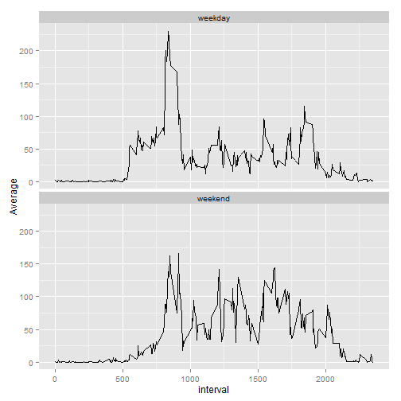

# Analysis of activity monitoring data

### (Assuming that the data file activity.csv is in the working directory)


A histogram of the total number of steps taken each day is followed.  


```r
activity <- read.csv("activity.csv")  
StepsPerDay <- tapply(activity$steps, activity$date, sum, na.rm = TRUE)  
StepsPerDay <- as.data.frame(StepsPerDay)  

library(ggplot2)  
ggplot(StepsPerDay, aes(x=StepsPerDay)) + geom_histogram(binwidth=1000, colour="black", fill="white")  
```

 
## Mean total number of steps taken per day

With the following code, we could get the mean of the total number of steps taken per day.

```r
meanperday <- round(mean(StepsPerDay$StepsPerDay),2)  
meanperday  
```

```
## [1] 9354.23
```

```r
medianperday <- median(StepsPerDay$StepsPerDay)  
medianperday  
```

```
## [1] 10395
```

The mean of the total number of steps taken per day is 9354.23. The median of the total number of steps taken per day is 10395.  

## Average daily activity pattern

The time series plot of average daily activity pattern is followed.  


```r
# get the mean steps of each interval across all days  
IntervalAverage <- tapply(activity$steps, factor(activity$interval), mean, na.rm = TRUE)  
IntervalAverage <- data.frame(Average=IntervalAverage, interval = as.numeric(names(IntervalAverage)))  
ggplot(IntervalAverage, aes(x=interval, y=Average)) + geom_line()  
```

 

We can observe the maximum numbers of steps in the plot, but when the maxumum occured is not easy to tell. We can get it using the following code.


```r
max_interval <- IntervalAverage[which(IntervalAverage$Average==max(IntervalAverage$Average)),"interval"];
max_interval  
```

```
## [1] 835
```

```r
max_hour <- max_interval%/%60  
max_min <- max_interval%%60  
max_time <- paste(max_hour,":", max_min, sep="")  
max_time  
```

```
## [1] "13:55"
```

On average across all the days in the dataset, the 5-minute interval started at 835, i.e., 13:55, contains the maximum number of steps.  


## Imputing missing values

To check how many values are missing in the data set, we could sum up the return of is.na() function.  

```r
total_na <- sum(is.na(activity$steps))  
total_na  
```

```
## [1] 2304
```

There are 2304 missing values in the dataset.  


For these missing values, we used the mean for a 5-minute interval to fill a missing value in that interval.  

A histogram of the total number of steps taken each day in the imputed data set is followed.   


```r
activity_new <- activity  
activity_new$steps[is.na(activity_new$steps)] <- IntervalAverage$Average[match(activity_new$interval[is.na(activity_new$steps)], IntervalAverage$interval)]  
StepsPerDay_imputed <- tapply(activity_new$steps, activity_new$date, sum)  
StepsPerDay_imputed <- as.data.frame(StepsPerDay_imputed)  
ggplot(StepsPerDay_imputed, aes(x=StepsPerDay_imputed)) + geom_histogram(binwidth=1000, colour="black", fill="white")  
```

 
 
In the imputed data set, the mean of the total number of steps taken per day should be different from the mean in the original data set. 

```r
meanperday_imputed <- round(mean(StepsPerDay_imputed$StepsPerDay_imputed),2)  
meanperday_imputed  
```

```
## [1] 10766.19
```

```r
medianperday_imputed <- round(median(StepsPerDay_imputed$StepsPerDay_imputed),2)  
medianperday_imputed  
```

```
## [1] 10766.19
```
In the imputed data set, the mean of the total number of steps taken per day is 1.076619 &times; 10<sup>4</sup>; the median of the total number of steps taken per day is 1.076619 &times; 10<sup>4</sup>. 

They are different from these estimated in the first part of the assignment. The mean and median of the total number of steps taken per day in the imputed data set are larger than these in the original data set. It is because in the previous data set, NAs contribute zero step to the total steps in that day, while imputed values contribute steps larger than zero. Therefore, mean increases and median tends to increase.


## Differences in activity patterns between weekdays and weekends

The following panel plot containing a time series plot (i.e. type = "l") of the 5-minute interval (x-axis) and the average number of steps taken, averaged across all weekday days or weekend days (y-axis).


```r
activity_new$day <- c("weekday", "weekend")[(weekdays(as.Date(activity_new$date)) %in% c("Saturday","Sunday")) + 1]  

activity_new_weekday <- activity_new[activity_new$day=="weekday",]  
activity_new_weekend <- activity_new[activity_new$day=="weekend",]  

activity_new_weekday_interval_average <- tapply(activity_new_weekday$steps, activity_new_weekday$interval,mean)  
interval1=names(activity_new_weekday_interval_average)  
activity_new_weekday_interval_average <- data.frame(Average=activity_new_weekday_interval_average,  day="weekday")  

activity_new_weekend_interval_average <- tapply(activity_new_weekend$steps, activity_new_weekend$interval,mean)  
interval2=names(activity_new_weekend_interval_average)  
activity_new_weekend_interval_average <- data.frame(Average=activity_new_weekend_interval_average, day="weekend")  

activity_new_weekdays_interval_average <- rbind(activity_new_weekday_interval_average, activity_new_weekend_interval_average)  
activity_new_weekdays_interval_average$interval <- as.numeric(c(interval1, interval2))  
ggplot(data=activity_new_weekdays_interval_average, aes(x=interval, y=Average))  + geom_line() + facet_wrap( ~ day, ncol=1)  
```

 
